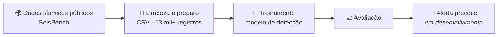
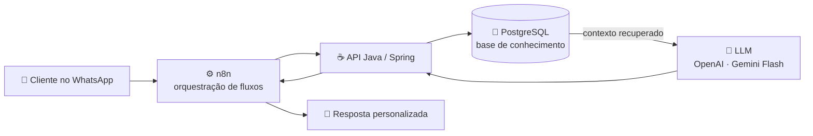

**Construo agentes de IA que trabalham de verdade: em produção, com clientes reais.**
 
🇺🇸 *I build AI agents that actually work: in production, with real customers.*

 

---

## 🏆 Em destaque

> ### Top 100 de mais de 20.000 candidatos (Top 0,5%)
> **Programa iFood GenAI (2025)**: selecionado pela capacidade de construir soluções reais com IA Generativa.
>
> 🇺🇸 *Top 100 out of 20,000+ candidates (top 0.5%) in the iFood GenAI Program (2025), selected for building real-world Generative AI solutions.*

---

## 👨‍💻 Sobre mim

Fundador da **Nexus OS**, estudante de Análise e Desenvolvimento de Sistemas (**Unijorge**) e de Licenciatura em Matemática (**IFBA**). Trabalho na fronteira entre **backend, dados e IA aplicada**: transformo dados brutos e não estruturados em informação útil para o negócio e entrego APIs robustas com Java e Spring Boot.

🇺🇸 *Founder of Nexus OS, studying Systems Analysis & Development and Mathematics Education. I work at the intersection of backend, data and applied AI: turning raw, unstructured data into business value and shipping robust Java/Spring Boot APIs.*

| | |
|---|---|
| 🔭 **Construindo agora** | Agentes autônomos de IA e pipelines de dados na Nexus OS |
| 🌱 **Aprofundando em** | Spring Boot, orquestração de LLMs e arquiteturas orientadas a dados |
| 💬 **Converse comigo sobre** | Java, Spring, IA generativa aplicada a negócio e engenharia de dados |

---

## 🎓 Formação

🇺🇸 *Education*

| Curso | Instituição | Status |
|---|---|---|
| 💻 Análise e Desenvolvimento de Sistemas | Unijorge | Cursando |
| 📐 Licenciatura em Matemática | IFBA | Cursando |

Estudo tecnologia e matemática ao mesmo tempo: a matemática me dá a base para entender *por que* os modelos funcionam, e a engenharia me permite colocá-los em produção.

🇺🇸 *I study technology and mathematics side by side: math gives me the foundation to understand why models work, and engineering lets me put them into production.*

---

## 🌋 Sismos + IA · projeto de iniciativa própria

Nascido dos estudos de cálculo e ondas sísmicas na licenciatura, este projeto busca construir um **sistema de detecção e alerta precoce** baseado em IA, treinando um modelo próprio sobre dados sísmicos públicos. O foco é segurança de estruturas de risco, como **barragens de rejeito** e áreas de **sismicidade induzida por mineração**.

🇺🇸 *Born from calculus and seismic-wave studies, this project aims to build an AI-based early detection and warning system, training a custom model on public seismic data. The focus is the safety of high-risk structures such as tailings dams and mining-induced seismicity.*

<b>📍 Estágio atual / Current status</b>

 

- ✅ Base de **mais de 13 mil registros** sísmicos em CSV, obtidos via SeisBench
- ✅ Modelo de IA com acesso a essa base
- 🚧 Treinamento, avaliação e alertas em desenvolvimento

🇺🇸 *13,000+ seismic records via SeisBench · model connected to the dataset · training, evaluation and alerting in progress.*

---

## 🚀 Nexus OS · CAIS

**Fundador & Engenheiro de IA**

O **CAIS** é um agente de IA autônomo que atende clientes pelo **WhatsApp** com respostas personalizadas, usando arquitetura **RAG** sobre uma base própria em PostgreSQL. É versátil o bastante para segmentos como **construtoras, imobiliárias e barbearias**, entre outros.

🇺🇸 *CAIS is an autonomous AI agent that serves customers on WhatsApp with personalized answers, using RAG over a custom PostgreSQL knowledge base. Flexible enough for construction firms, real estate agencies, barbershops and more.*

<b>🔍 Ver o que tem por baixo do capô / Under the hood</b>

 

- 🤖 **Orquestração de LLMs**: OpenAI e Gemini Flash em produção, com foco em respostas contextualizadas e confiáveis
- 🧠 **RAG**: recuperação de contexto sobre base própria em PostgreSQL para personalizar cada resposta
- ⚙️ **RPA & BPM**: automação de processos de negócio ponta a ponta, integrando fluxos via **n8n**
- 🔌 **Backend & integrações**: APIs REST/HTTP com Java e Spring, conectando o agente a canais e sistemas do cliente

🇺🇸 *LLM orchestration in production · RAG over PostgreSQL · end-to-end process automation with n8n · REST integrations with Java/Spring.*

`Java` `Spring` `OpenAI` `Gemini Flash` `n8n` `RAG` `PostgreSQL` `REST APIs`

**[➡️ Ver o repositório do CAIS](https://github.com/yDevLuisDias/CAIS---NEXUS-OS)**

---

## 🛠️ Stack

🇺🇸 *Tech stack: what I use to build things*

 

<table>
<tr>
<td width="50%" valign="top">

#### ☕ Backend

</td>
<td width="50%" valign="top">

#### 🧠 IA & Agentes

</td>
</tr>
<tr>
<td width="50%" valign="top">

#### 🗄️ Dados & Automação

</td>
<td width="50%" valign="top">

#### 🧰 Linguagens & Ferramentas

</td>
</tr>
</table>

---

## 📌 Projetos

🇺🇸 *Featured projects: click a name to open the repo*

| Projeto | O que faz · 🇺🇸 *what it does* | Stack | Atividade |
|---|---|---|---|
| 🤖 **[CAIS · Nexus OS](https://github.com/yDevLuisDias/CAIS---NEXUS-OS)** | Agente de IA no WhatsApp com RAG sobre PostgreSQL, em produção com clientes reais.  🇺🇸 *WhatsApp AI agent with RAG over PostgreSQL, live with real customers.* |    |  |
| ⚡ **[AI-Driver ETL](https://github.com/yDevLuisDias/AI-Driver-ETL)** | Extrai dados estruturados de texto livre e classifica intenção de compra para qualificar leads.  🇺🇸 *Extracts structured data from free text and classifies purchase intent to qualify leads.* |    |  |
| 🏦 **[Bank Account](https://github.com/yDevLuisDias/Bank-Account)** | API REST bancária com Spring Security, JPA e arquitetura em camadas (core/infra).  🇺🇸 *Banking REST API with Spring Security, JPA and a layered architecture.* |    |  |
| 📄 **[CSV Processor](https://github.com/yDevLuisDias/CSV-Processor)** | Lê, valida e exporta CSV, separando registros válidos de inválidos.  🇺🇸 *Reads, validates and exports CSV, splitting valid from invalid records.* |   |  |
| 🌍 **[BioCode](https://github.com/yDevLuisDias/bio_code)** | Jogo educativo que ensina lógica de programação com missões de sustentabilidade (COP30).  🇺🇸 *Educational game teaching programming logic through sustainability missions.* |   |  |
| 🚧 **[ETL-Process](https://github.com/yDevLuisDias/ETL-Process)** | *Em desenvolvimento:* PoC de ETL com Spring Batch para CSV, JSON e XML.  🇺🇸 *WIP: Spring Batch ETL proof of concept for CSV, JSON and XML.* |   |  |

---

## 📊 Minha atividade no GitHub

🇺🇸 *My GitHub activity: commits, pull requests, issues and contributions*

### ⚡ Atividade recente

🇺🇸 *Latest activity (updated automatically)*

<!--START_SECTION:activity-->
<!--END_SECTION:activity-->

### 🐍 Contribuições

<picture>
  <source media="(prefers-color-scheme: dark)" srcset="https://raw.githubusercontent.com/yDevLuisDias/yDevLuisDias/output/github-snake-dark.svg" />
  <source media="(prefers-color-scheme: light)" srcset="https://raw.githubusercontent.com/yDevLuisDias/yDevLuisDias/output/github-snake.svg" />
  
</picture>

---

### 🤝 Vamos construir algo?

Tem um processo que dá para automatizar com IA? Uma vaga? Uma ideia?
 
🇺🇸 *Got a process that could be automated with AI? A role? An idea?*

 

