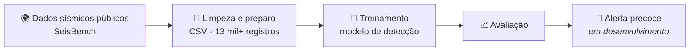
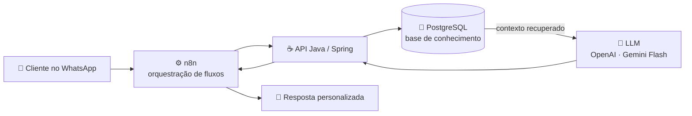

🇺🇸 *I build AI agents that run in production · Java & Spring Boot backend · RAG, automation and data*

 

---

## 🏆 Em destaque

> ### Top 100 de mais de 20.000 candidatos (Top 0,5%)
> **Programa iFood GenAI (2025)**: selecionado pela capacidade de construir soluções reais com IA Generativa.
>
> 🇺🇸 *Top 100 out of 20,000+ candidates (top 0.5%) in the iFood GenAI Program (2025), selected for building real-world Generative AI solutions.*

## 👋 Sobre mim

Fundador da **Nexus OS**, estudante de Análise e Desenvolvimento de Sistemas (**Unijorge**) e de Licenciatura em Matemática (**IFBA**). Trabalho na fronteira entre **backend, dados e IA aplicada**: transformo dados brutos e não estruturados em informação útil para o negócio e entrego APIs robustas com Java e Spring Boot.

🇺🇸 *Founder of Nexus OS, studying Systems Analysis & Development and Mathematics Education. I work at the intersection of backend, data and applied AI: turning raw, unstructured data into business value and shipping robust Java/Spring Boot APIs.*

- 🔭 Construindo agentes autônomos de IA e pipelines de dados na **Nexus OS**
- 🌱 Aprofundando em Spring Boot, orquestração de LLMs e arquiteturas orientadas a dados
- 📐 Usando matemática e IA em um projeto de **detecção sísmica**
- 💬 Fale comigo sobre **Java, Spring, IA generativa aplicada a negócio ou engenharia de dados**

## 🎓 Formação

🇺🇸 *Education*

| Curso | Instituição | Status |
|---|---|---|
| 💻 Análise e Desenvolvimento de Sistemas | Unijorge | Cursando |
| 📐 Licenciatura em Matemática | IFBA | Cursando |

Estudo tecnologia e matemática ao mesmo tempo: a matemática me dá a base para entender *por que* os modelos funcionam, e a engenharia me permite colocá-los em produção.

🇺🇸 *I study technology and mathematics side by side: math gives me the foundation to understand why models work, and engineering lets me put them into production.*

## 🛠️ Stack

🇺🇸 *Tech stack*

 

<table>
<tr>
<td width="50%" valign="top">

#### ☕ Backend

</td>
<td width="50%" valign="top">

#### 🧠 IA & Agentes

</td>
</tr>
<tr>
<td width="50%" valign="top">

#### 🗄️ Dados & Automação

</td>
<td width="50%" valign="top">

#### 🧰 Linguagens & Ferramentas

</td>
</tr>
</table>

## 🚀 Projetos em destaque

🇺🇸 *Featured projects*

<table>
<tr>
<td width="50%" valign="top">

### [🤖 CAIS · Nexus OS](https://github.com/yDevLuisDias/CAIS---NEXUS-OS)

Agente de IA no WhatsApp com **RAG sobre PostgreSQL**, em produção com clientes reais (construtoras, imobiliárias, barbearias e mais).

🇺🇸 *WhatsApp AI agent with RAG over PostgreSQL, live with real customers.*

`Java` `Spring` `n8n` `RAG` `PostgreSQL`

</td>
<td width="50%" valign="top">

### [🌋 Sismos + IA](#-sismos--ia)

Sistema de **detecção e alerta precoce** de eventos sísmicos com IA, focado em barragens de rejeito. *Em desenvolvimento.*

🇺🇸 *AI early detection and warning for seismic events, focused on tailings dams. In development.*

`Python` `SeisBench` `Machine Learning`

</td>
</tr>
<tr>
<td width="50%" valign="top">

### [⚡ AI-Driver ETL](https://github.com/yDevLuisDias/AI-Driver-ETL)

Extrai dados estruturados de texto livre e classifica **intenção de compra** com Spring AI + OpenAI, automatizando a qualificação de leads.

🇺🇸 *Extracts structured data from free text and classifies purchase intent to qualify leads.*

`Java` `Spring Boot` `Spring AI` `PostgreSQL`

</td>
<td width="50%" valign="top">

### [🏦 Bank Account](https://github.com/yDevLuisDias/Bank-Account)

API REST bancária com **Spring Security**, JPA e arquitetura em camadas (core/infra).

🇺🇸 *Banking REST API with Spring Security, JPA and a layered architecture.*

`Java` `Spring Boot` `Spring Security` `JPA`

</td>
</tr>
<tr>
<td width="50%" valign="top">

### [📄 CSV Processor](https://github.com/yDevLuisDias/CSV-Processor)

Lê, valida e exporta CSV, separando registros válidos de inválidos com tratamento de exceções.

🇺🇸 *Reads, validates and exports CSV, splitting valid from invalid records.*

`Java` `OOP` `Validação de dados`

</td>
<td width="50%" valign="top">

### [🌍 BioCode](https://github.com/yDevLuisDias/bio_code)

Jogo educativo em JavaScript puro que ensina lógica de programação com missões de sustentabilidade (COP30).

🇺🇸 *Educational game teaching programming logic through sustainability missions.*

`JavaScript` `HTML5 Canvas` `CSS`

</td>
</tr>
</table>

🚧 <b>Em desenvolvimento / Work in progress</b>

 

**[ETL-Process](https://github.com/yDevLuisDias/ETL-Process)**: PoC de pipeline ETL com **Spring Batch** para CSV, JSON e XML.

🇺🇸 *Proof of concept ETL pipeline with Spring Batch ingesting CSV, JSON and XML files.*

## 🌋 Sismos + IA

Projeto de iniciativa própria, nascido dos estudos de cálculo e ondas sísmicas na licenciatura: um **sistema de detecção e alerta precoce** baseado em IA, treinando um modelo próprio sobre dados sísmicos públicos. O foco é a segurança de estruturas de risco, como **barragens de rejeito** e áreas de **sismicidade induzida por mineração**.

🇺🇸 *Self-initiated project born from calculus and seismic-wave studies: an AI-based early detection and warning system, training a custom model on public seismic data, focused on tailings dams and mining-induced seismicity.*

<b>📍 Estágio atual / Current status</b>

 

- ✅ Base de **mais de 13 mil registros** sísmicos em CSV, obtidos via SeisBench
- ✅ Modelo de IA com acesso a essa base
- 🚧 Treinamento, avaliação e alertas em desenvolvimento

🇺🇸 *13,000+ seismic records via SeisBench · model connected to the dataset · training, evaluation and alerting in progress.*

## 🤖 Nexus OS · CAIS

**Fundador & Engenheiro de IA**

O **CAIS** é um agente de IA autônomo que atende clientes pelo **WhatsApp** com respostas personalizadas, usando arquitetura **RAG** sobre uma base própria em PostgreSQL. É versátil o bastante para segmentos como **construtoras, imobiliárias e barbearias**, entre outros.

🇺🇸 *CAIS is an autonomous AI agent that serves customers on WhatsApp with personalized answers, using RAG over a custom PostgreSQL knowledge base. Flexible enough for construction firms, real estate agencies, barbershops and more.*

<b>🔍 Ver o que tem por baixo do capô / Under the hood</b>

 

- 🤖 **Orquestração de LLMs**: OpenAI e Gemini Flash em produção, com foco em respostas contextualizadas e confiáveis
- 🧠 **RAG**: recuperação de contexto sobre base própria em PostgreSQL para personalizar cada resposta
- ⚙️ **RPA & BPM**: automação de processos de negócio ponta a ponta, integrando fluxos via **n8n**
- 🔌 **Backend & integrações**: APIs REST/HTTP com Java e Spring, conectando o agente a canais e sistemas do cliente

🇺🇸 *LLM orchestration in production · RAG over PostgreSQL · end-to-end process automation with n8n · REST integrations with Java/Spring.*

## 🤝 Vamos construir algo?

Tem um processo que dá para automatizar com IA? Uma vaga? Uma ideia? Fico feliz em conversar.

🇺🇸 *Got a process that could be automated with AI? A role? An idea? Happy to chat.*

